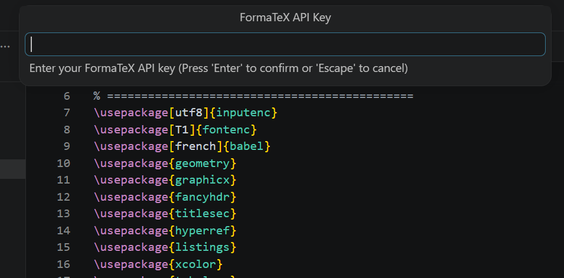
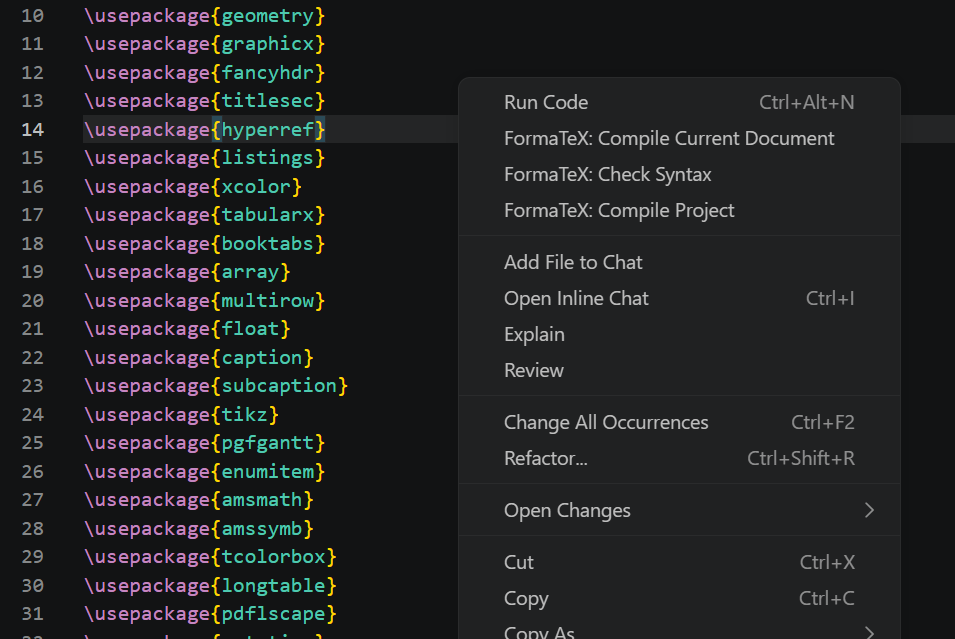
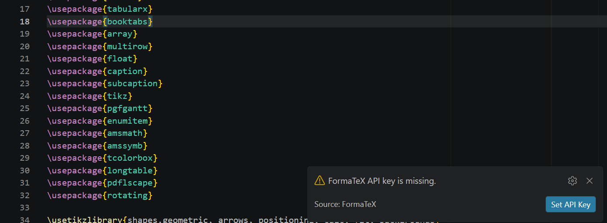

# FormaTeX VS Code Extension

Compile LaTeX using FormaTeX API directly from VS Code.

## Install

- Marketplace: https://marketplace.visualstudio.com/items?itemName=formatex-io.formatex
- Extension ID: `formatex-io.formatex`

## Features

- Secure API key storage using VS Code Secret Storage
- Compile current `.tex` document
- Compile selected `.tex` file from Explorer
- Compile full LaTeX project with dependency packaging
- Syntax check without full compilation
- Save output PDFs to `.formatex/output`
- Show compile logs and diagnostics

## Commands

- `FormaTeX: Set API Key`
- `FormaTeX: Clear API Key`
- `FormaTeX: Compile Current Document`
- `FormaTeX: Compile Selected File`
- `FormaTeX: Compile Project`
- `FormaTeX: Check Syntax`
- `FormaTeX: Open Last PDF`
- `FormaTeX: Show Compile Output`
- `FormaTeX: Show Usage`

## Quick Start

1. Install the extension from Marketplace.
2. Open a `.tex` file in VS Code.
3. Run `FormaTeX: Set API Key` from the command palette.
4. Right-click in editor or explorer and choose:
	- `FormaTeX: Compile Current Document`
	- `FormaTeX: Compile Selected File`
	- `FormaTeX: Compile Project`

Compiled PDFs are saved in `.formatex/output`.

## Screenshots

