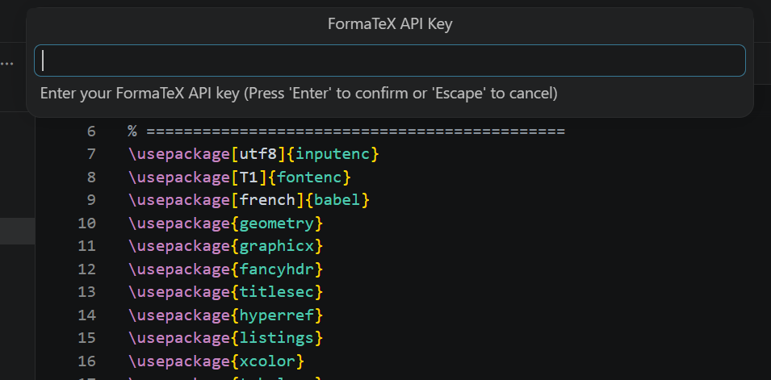
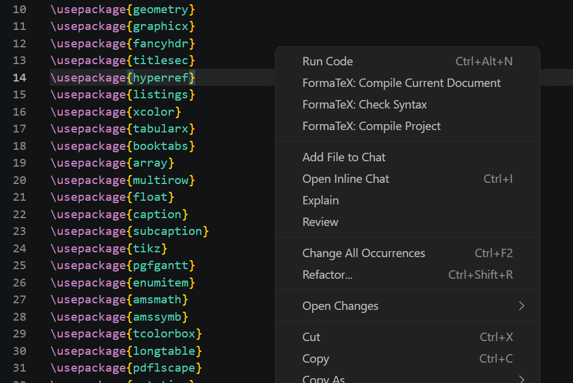
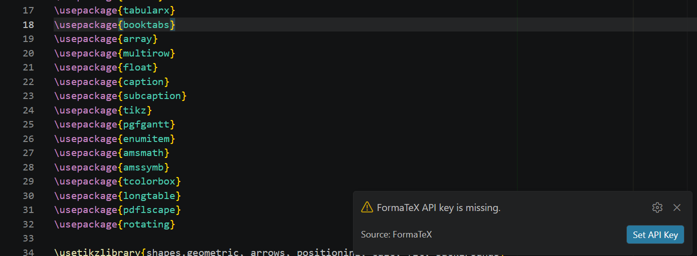

# FormaTeX VS Code Extension

Compile LaTeX using the FormaTeX API directly from VS Code, and optionally sync FormaTeX cloud projects straight into your editor.

## Install

- Marketplace: https://marketplace.visualstudio.com/items?itemName=formatex-io.formatex
- Extension ID: `formatex-io.formatex`

## Features

### Local compile

- Secure API key storage using VS Code Secret Storage
- Compile current `.tex` document, a selected `.tex` file, or a full project with automatic dependency packaging (`\input`/`\include`/`\bibliography`/`\includegraphics`)
- Syntax check without full compilation
- Choose a compile engine (`FormaTeX: Select Compile Engine`) — Auto (FormaTeX's smart engine detection), pdflatex, xelatex, lualatex, or latexmk
- Compiled PDF opens automatically beside your source as a live-updating preview
- Save output PDFs to `.formatex/output`
- Show compile logs and diagnostics

### Cloud projects

- Projects panel in the Activity Bar — browse, open, and manage your FormaTeX cloud projects
- Open a project as a virtual workspace (`formatex://`) with edits synced automatically, or download it to a local folder
- Conflict detection: if a file changes on the server while you're editing it locally, you're prompted to overwrite or reload rather than silently losing either version
- **Add as Cloud Project**: right-click any local `.tex` file to turn it into a new FormaTeX cloud project. The extension detects the project root and file set automatically by following the file's `\input`/`\include`/`\bibliography`/`\includegraphics` references — so picking a `.tex` nested inside a larger repo only uploads that subfolder, not your whole codebase
- Rename/delete cloud files, compile a cloud project, open it in the browser, copy its ID

## Commands

- `FormaTeX: Set API Key`
- `FormaTeX: Clear API Key`
- `FormaTeX: Compile Current Document`
- `FormaTeX: Compile Selected File`
- `FormaTeX: Compile Project`
- `FormaTeX: Check Syntax`
- `FormaTeX: Select Compile Engine`
- `FormaTeX: Add as Cloud Project`
- `FormaTeX: Open Last PDF`
- `FormaTeX: Show Compile Output`
- `FormaTeX: Show Usage`
- `FormaTeX: Show Project Actions`
- `FormaTeX: Open Project` / `Open Project Locally` / `Open Project in Browser`
- `FormaTeX: Compile Cloud Project`
- `FormaTeX: Refresh Project Files`
- `FormaTeX: Copy Project ID`
- `FormaTeX: Open File` / `Rename File` / `Delete File`

## Quick Start

1. Install the extension from Marketplace.
2. Run `FormaTeX: Set API Key` from the command palette.
3. Open a `.tex` file in VS Code, right-click, and choose:
	- `FormaTeX: Compile Current Document`
	- `FormaTeX: Compile Selected File`
	- `FormaTeX: Compile Project`
	- `FormaTeX: Add as Cloud Project` — to turn a local file/folder into a synced FormaTeX cloud project

Compiled PDFs open automatically beside your editor and are also saved in `.formatex/output`.

To work with existing cloud projects, open the FormaTeX panel in the Activity Bar.

## Screenshots

